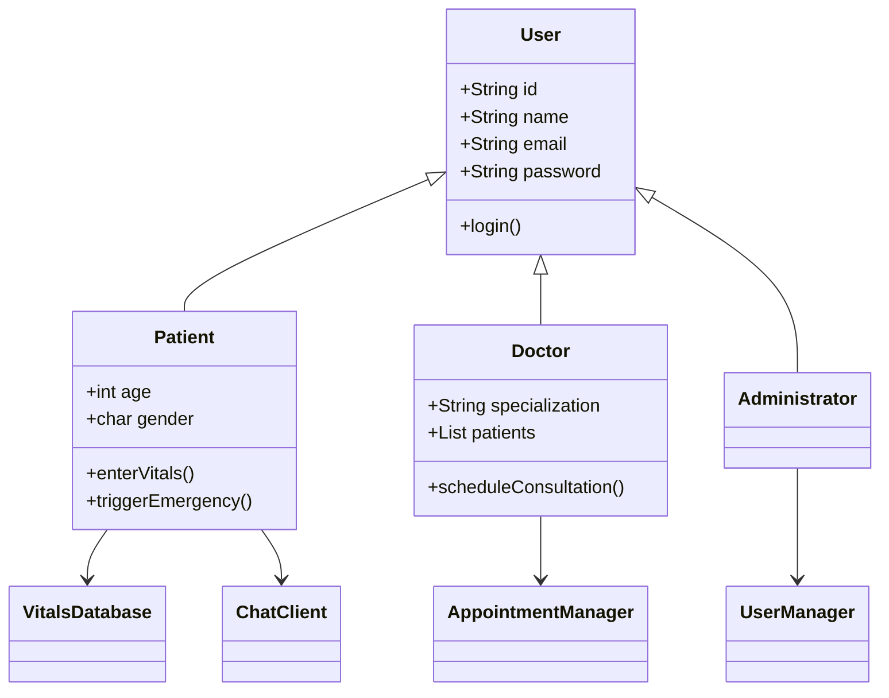

# Remote Health Management System (RHMS)

  
*A comprehensive Java-based telemedicine platform connecting doctors, patients, and administrators*

## 📌 Table of Contents
- [Key Features](#-key-features)
- [Technical Architecture](#-technical-architecture)
- [Installation Guide](#-installation-guide)
- [System Workflows](#-system-workflows)
- [Class Structure](#-class-structure)
- [Security Considerations](#-security-considerations)
- [Future Enhancements](#-future-enhancements)
- [Evaluation Criteria](#-evaluation-criteria)
- [Contributor](#-contributors)
- [Login Credentials](#-login-credentials)
- [User Registration](#-user-registration)

## ✨ Key Features

### 👨‍⚕️ Doctor Portal
- Real-time patient vitals monitoring with emergency alerts
- Secure messaging system with patients
- Video consultation scheduling (Zoom/Meet integration)
- Electronic prescription management
- Appointment tracking system
- Feedback management system
- Email sending using gmail SMTP and java mail library

### 🏥 Patient Portal
- Vital signs entry with automatic anomaly detection
- Medical history access
- Emergency panic button
- Doctor communication system
- Appointment management

### 👨‍💼 Admin Portal
- Comprehensive user management (CRUD operations)
- System monitoring dashboard
- User activity logs
- Role-based access control

## 🖥️ Technical Architecture

| Component          | Technology Used                 |
|--------------------|---------------------------------|
| Core Language      | Java 21+                       |
| Data Storage       | In-memory collections          |
| Messaging         | Custom ChatServer implementation|
| Notifications     | Email/SMS (Interface-based)    |
| Security          | Password-based authentication  |
| Date/Time        | Java Time API (LocalDateTime)  |

## ⚙️ Installation Guide

### Prerequisites
- Java JDK 11 or later
- Maven (for dependency management)

### Setup Instructions
```bash
# Clone repository 
git clone [https://github.com/Ailya-Shah/OOP-RHMS]
cd RHMS

# Compile all source files
javac *.java

# Run the application
java RHMS
```

## 🚀 System Workflows

### Emergency Alert Flow
1. Patient enters abnormal vitals
2. System detects critical values:
   - Heart rate < 60 or >120 bpm
   - Oxygen <90%
   - BP outside 90/60-120/80 range
3. Automatic notification sent to:
   - Assigned doctor
   - Emergency contacts

### Video Consultation Flow
1. Doctors schedules a meeting and provides zoom or a google meet link for it and it is stored.
2. Patient can check his logs from patient menu to see the scheduled meetings with doctors.
3. System tracks consultation status.

## 📐 Class Structure



## 🔒 Security Considerations

### Implementation
- Basic password authentication
- In-memory data storage
- Plaintext credentials


## 🔑 Login Credentials

### Pre-registered Users

#### Administrator
- **ID:** A001
- **Email:** admin@example.com
- **Password:** admin123

#### Doctors
1. **Dr. Smith (Cardiologist)**
   - **ID:** D001
   - **Email:** smith@example.com
   - **Password:** doc123

2. **Dr. Johnson (Dermatologist)**
   - **ID:** D002
   - **Email:** johnson@example.com
   - **Password:** doc456

3. **Dr. Wajeeh (Neurologist)**
   - **ID:** D003
   - **Email:** wajeeh@example.com
   - **Password:** Wajeeh123

#### Patients
1. **Ali**
   - **ID:** P001
   - **Email:** ali@example.com
   - **Password:** ali123

2. **Ailya**
   - **ID:** P002
   - **Email:** ailya@example.com
   - **Password:** Ailya1234

## 📝 User Registration

### New User Registration Feature

The system now includes a comprehensive user registration system that allows new users to join the platform as administrators, doctors, or patients.

#### Registration Process:
1. From the main menu, select "Register New User"
2. Choose your role (Admin/Doctor/Patient)
3. Provide required information:
   - **For All Users:**
     - Unique ID
     - Full name
     - Email address
     - Password
   - **Additional for Doctors:**
     - Specialization
   - **Additional for Patients:**
     - Age
     - Gender
     - Phone number

#### Key Features:
- **Role-Based Registration:** Different forms for each user type
- **Immediate Access:** New users can login immediately after registration
- **Data Validation:** Basic input validation ensures required fields are completed
- **Unique IDs:** System doesn't check for duplicate IDs (enhancement opportunity)

#### Technical Implementation:
- Uses the same constructors as pre-registered users
- Stores new users in the same in-memory collections
- Maintains all existing functionality for new users
- Registration handled through dedicated methods in main class

#### Example Registration Flow:
```text
=== Remote Health Management System ===

1. Login
2. Register New User
3. Exit
Choose option: 2

=== Register New User ===
1. Register as Admin
2. Register as Doctor
3. Register as Patient
4. Back to Main Menu
Choose role to register: 2

=== Register New Doctor ===
Enter Doctor ID: D004
Enter Name: Dr. Brown
Enter Email: brown@example.com
Enter Password: doc789
Enter Specialization: Pediatrician

Doctor registered successfully!
```

**Note:** The first admin account is pre-created, but the system allows registering new admin accounts which can replace the original admin.

## 📜 Evaluation Criteria

| Category                          | Marks |
|-----------------------------------|-------|
| Class Implementation              | 20    |
| Interface Implementation          | 20    |
| Main Application Functionality    | 10    |
| **Total**                         | **50**|

## 👥 Contributors

| Name            | ID     | Contribution Area               |
|-----------------|--------|---------------------------------|
| Ailya Zainab    | 523506 | Core System Architecture        |
