# Remote Health Management System (RHMS)

  
*A comprehensive Java-based telemedicine platform connecting doctors, patients, and administrators*

## 📌 Table of Contents
- [Key Features](#-key-features)
- [Technical Architecture](#-technical-architecture)
- [Installation Guide](#-installation-guide)
- [System Workflows](#-system-workflows)
- [Class Structure](#-class-structure)
- [Security Considerations](#-security-considerations)
- [Future Enhancements](#-future-enhancements)
- [Evaluation Criteria](#-evaluation-criteria)
- [Contributor](#-contributors)

## ✨ Key Features

### 👨‍⚕️ Doctor Portal
- Real-time patient vitals monitoring with emergency alerts
- Secure messaging system with patients
- Video consultation scheduling (Zoom/Meet integration)
- Electronic prescription management
- Appointment tracking system
- Feedback management system
- Email sending using gmail SMTP and java mail library

### 🏥 Patient Portal
- Vital signs entry with automatic anomaly detection
- Medical history access
- Emergency panic button
- Doctor communication system
- Appointment management

### 👨‍💼 Admin Portal
- Comprehensive user management (CRUD operations)
- System monitoring dashboard
- User activity logs
- Role-based access control

## 🖥️ Technical Architecture

| Component          | Technology Used                 |
|--------------------|---------------------------------|
| Core Language      | Java 21+                       |
| Data Storage       | In-memory collections          |
| Messaging         | Custom ChatServer implementation|
| Notifications     | Email/SMS (Interface-based)    |
| Security          | Password-based authentication  |
| Date/Time        | Java Time API (LocalDateTime)  |

## ⚙️ Installation Guide

### Prerequisites
- Java JDK 11 or later
- Maven (for dependency management)

### Setup Instructions
```bash
# Clone repository (if applicable)
git clone [repository-url]
cd RHMS

# Compile all source files
javac *.java

# Run the application
java RHMS
```

## 🚀 System Workflows

### Emergency Alert Flow
1. Patient enters abnormal vitals
2. System detects critical values:
   - Heart rate < 60 or >120 bpm
   - Oxygen <90%
   - BP outside 90/60-120/80 range
3. Automatic notification sent to:
   - Assigned doctor
   - Emergency contacts

### Video Consultation Flow
1. Doctors schedules a meeting and provides zoom or a google meet link for it and it is stored.

2. Patient can check his logs from patient menu to see the scheduled meetings with doctors.

3. System tracks consultation status.

## 📐 Class Structure

```mermaid
classDiagram
    class User{
        +String id
        +String name
        +String email
        +String password
        +login()
    }
    
    User <|-- Patient
    User <|-- Doctor
    User <|-- Administrator
    
    Patient --> VitalsDatabase
    Patient --> ChatClient
    Doctor --> AppointmentManager
    Administrator --> UserManager
    
    class Patient{
        +int age
        +char gender
        +enterVitals()
        +triggerEmergency()
    }
    
    class Doctor{
        +String specialization
        +List<Patient> patients
        +scheduleConsultation()
    }
```



## 🔒 Security Considerations

###  Implementation
- Basic password authentication
- In-memory data storage
- Plaintext credentials


## 📜 Evaluation Criteria


| Category                          | Marks |
|-----------------------------------|-------|
| Class Implementation              | 20    |
| Interface Implementation          | 20    |
| Main Application Functionality    | 10    |
| **Total**                         | **50**|


## 👥 Contributors

| Name            | ID     | Contribution Area               |
|-----------------|--------|---------------------------------|
| Ailya Zainab    | 523506 | Core System Architecture        |

---
